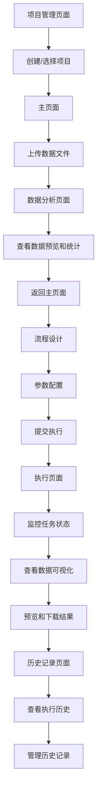

# 数据处理Web应用产品需求文档

## 1. Product Overview

本项目是一个基于Web的数据处理平台，提供可视化的数据处理流程设计和执行能力。用户可以通过拖拽节点的方式构建数据处理流水线，每个节点代表特定的数据处理操作，系统将自动解析流程配置并执行相应的数据处理任务。平台支持CSV和Parquet两种主流数据格式的文件上传，并在数据处理前后提供丰富的图表可视化功能。

该平台主要解决数据分析师和工程师在数据处理过程中需要编写复杂代码的痛点，通过可视化界面降低数据处理的技术门槛，提高数据处理效率。项目采用现代化的uv工具进行Python依赖管理，确保开发和部署的一致性。目标是成为轻量级、易用的数据处理工具平台。

## 2. Core Features

### 2.1 User Roles

本应用采用无需登录的设计，所有用户均可直接使用全部功能，包括：

* 上传CSV和Parquet格式的数据文件

* 创建和编辑数据处理流程

* 执行数据处理任务

* 查看数据可视化图表和处理结果

* 下载处理后的数据文件

### 2.2 Feature Module

我们的数据处理平台包含以下主要页面：

1. **项目管理页面**：项目列表展示，项目创建和编辑，项目状态管理
2. **主页面**：数据文件上传区域，流程图设计器，节点库面板，属性配置面板
3. **执行页面**：任务状态监控，执行日志查看，数据可视化图表，结果预览
4. **数据分析页面**：数据预览表格，统计信息展示，交互式图表组件
5. **历史记录页面**：执行历史列表，历史记录详情，步骤级别的结果查看

### 2.3 Page Details

| Page Name | Module Name | Feature description                                     |
| --------- | ----------- | ------------------------------------------------------- |
| 项目管理页面    | 项目列表        | 展示所有项目的卡片式列表，包括项目名称、状态、创建时间、最后执行时间等信息                   |
| 项目管理页面    | 项目创建        | 提供项目创建表单，包括项目名称、描述、标签、分类等字段输入                           |
| 项目管理页面    | 项目操作        | 支持项目编辑、删除、归档、复制等操作，提供项目状态切换功能                           |
| 主页面       | 文件上传区域      | 支持拖拽上传CSV和Parquet文件，显示文件信息和上传进度，文件格式验证                  |
| 主页面       | 流程图设计器      | 支持拖拽创建节点，连接节点形成数据流，实时预览流程结构，支持撤销重做操作                    |
| 主页面       | 节点库面板       | 提供数据输入、数据清洗、数据转换、数据聚合、数据输出等分类节点，支持节点搜索和筛选，包含时间数据识别与处理节点 |
| 主页面       | 属性配置面板      | 配置选中节点的参数，包括处理逻辑、输出格式、图表类型、时间格式识别、多变量分析选项等              |
| 执行页面      | 任务监控        | 显示当前运行任务状态，包括进度条、执行时间、数据处理量统计                           |
| 执行页面      | 日志查看        | 实时显示执行日志，支持日志级别筛选，错误高亮显示                                |
| 执行页面      | 数据可视化       | 展示处理前后的数据对比图表，包括柱状图、折线图、散点图、热力图等                        |
| 执行页面      | 结果预览        | 展示数据处理结果表格，支持分页浏览，提供CSV和Parquet格式下载                     |
| 数据分析页面    | 数据预览        | 显示上传文件的数据表格，支持列排序、筛选和搜索功能                               |
| 数据分析页面    | 统计信息        | 展示数据集的基本统计信息，包括行数、列数、数据类型、缺失值统计                         |
| 数据分析页面    | 交互式图表       | 提供多种图表类型选择，支持字段映射配置，实时生成可视化图表                           |
| 历史记录页面    | 执行历史列表      | 展示项目的所有执行历史记录，包括执行时间、状态、处理数据量等信息                        |
| 历史记录页面    | 历史记录详情      | 显示单次执行的详细信息，包括输入参数、输出结果、执行时间等                           |
| 历史记录页面    | 步骤级查看       | 展示执行过程中每个步骤的详细结果，支持步骤级别的数据查看和下载                         |
| 历史记录页面    | 记录管理        | 支持删除特定的执行记录或执行步骤，提供批量删除功能                               |

## 3. Core Process

**主要用户流程：**
用户首先访问项目管理页面，可以创建新项目或选择现有项目进入。在项目内，用户在文件上传区域拖拽或选择CSV/Parquet格式的数据文件进行上传。文件上传完成后，系统自动解析文件结构并在数据分析页面展示数据预览、统计信息和基础图表。用户可以在主页面的流程图设计器中拖拽节点创建数据处理流程，从节点库中选择数据输入节点（关联已上传的文件），然后添加数据处理节点（如过滤、聚合、转换等）并设置相应参数，最后添加数据输出和可视化节点。流程设计完成后，用户提交执行，系统解析流程配置并在后端运行，同时记录执行历史。用户可以在执行页面监控任务状态，查看实时日志，观察数据处理前后的对比图表，并在任务完成后预览结果表格和下载处理后的数据文件。用户还可以在历史记录页面查看项目的所有执行历史，包括每次执行的详细步骤和结果，并可以删除不需要的历史记录。

## 4. User Interface Design

### 4.1 Design Style

* **主色调**：科技蓝 (#0066FF) 作为主色，深空灰 (#1A1A1A) 作为背景色，辅以霓虹青 (#00FFFF) 和量子紫 (#8A2BE2) 作为强调色

* **按钮样式**：具有发光边框效果的圆角按钮，支持悬停时的霓虹光晕动画和点击时的脉冲效果

* **字体**：现代科技感无衬线字体，标题使用 16-18px 加粗，正文使用 14px，关键数据使用等宽字体

* **布局风格**：暗色主题的左侧导航 + 主内容区域布局，支持面板拖拽调整，边框使用渐变光效

* **图标风格**：线性科技图标配合发光效果，使用几何化设计语言，保持未来感视觉一致性

* **视觉效果**：毛玻璃效果面板、微妙的粒子动画背景、数据流动效果、渐变光束装饰

* **交互动画**：流畅的过渡动画、数据加载时的科技感进度条、节点连接时的能量流动效果

### 4.2 Page Design Overview

| Page Name | Module Name | UI Elements                                                    |
| --------- | ----------- | -------------------------------------------------------------- |
| 项目管理页面    | 项目列表        | 响应式卡片网格布局，每个项目卡片显示项目名称、状态标签、创建时间、最后执行时间，支持搜索和筛选                |
| 项目管理页面    | 项目创建        | 模态对话框形式的创建表单，包含项目名称输入框、描述文本域、标签选择器、分类下拉菜单                      |
| 项目管理页面    | 项目操作        | 卡片右上角的操作菜单，包含编辑、删除、归档、复制等选项，支持批量操作                             |
| 主页面       | 文件上传区域      | 虚线边框的拖拽区域，支持点击选择文件，显示上传进度条和文件信息卡片                              |
| 主页面       | 流程图设计器      | 深色画布背景配合发光网格线，节点使用带有霓虹边框的圆角卡片样式，连接线使用发光贝塞尔曲线配合数据流动动画，支持缩放和平移操作 |
| 主页面       | 节点库面板       | 左侧固定面板，分类折叠列表，节点图标 + 文字描述，支持拖拽到画布                              |
| 主页面       | 属性配置面板      | 右侧固定面板，表单样式配置界面，支持不同类型参数输入（文本、下拉、数值、图表类型选择等）                   |
| 执行页面      | 任务监控        | 科技感卡片布局显示任务信息，进度条使用霓虹蓝渐变配合脉冲动画，状态使用发光色彩标识和动态图标                 |
| 执行页面      | 数据可视化       | 响应式图表网格布局，支持图表类型切换，颜色主题配置，图表交互和缩放功能                            |
| 执行页面      | 结果预览        | 表格使用斑马纹样式，支持虚拟滚动，提供下载按钮和格式选择                                   |
| 数据分析页面    | 数据预览        | 固定表头的数据表格，支持列宽调整，行选择和排序功能                                      |
| 数据分析页面    | 统计信息        | 卡片式统计面板，使用图标和数字展示，支持数据类型颜色编码                                   |
| 数据分析页面    | 交互式图表       | 图表配置面板 + 实时预览区域，支持字段拖拽映射，图表类型快速切换                              |
| 历史记录页面    | 执行历史列表      | 时间线样式的历史记录列表，每条记录显示执行时间、状态、处理数据量，支持时间范围筛选                      |
| 历史记录页面    | 历史记录详情      | 展开式详情面板，显示执行参数、结果统计、图表预览，支持结果数据下载                              |
| 历史记录页面    | 步骤级查看       | 可折叠的步骤列表，每个步骤显示处理时间、输入输出数据量、状态图标                               |
| 历史记录页面    | 记录管理        | 批量选择复选框，删除确认对话框，支持按时间范围或状态批量删除                                 |

### 4.3 Responsiveness

产品采用桌面优先设计，主要面向PC端用户。考虑到流程图设计的复杂性，暂不支持移动端适配，但确保在不同分辨率的桌面显示器上都能正常使用。界面支持最小宽度 1200px 的显示。

## 5. 数据处理特殊要求

### 5.1 时间数据识别与处理

系统需要具备智能的时间数据识别和处理能力：

* **自动识别机制**：系统自动识别输入数据的第一列作为时间数据列

* **支持的时间列名称**：

  * `DateTime`：标准日期时间格式（如：2025-01-15 14:30:00）

  * `tagTime`：小时数据格式（如：2025081509，表示2025年8月15日9点）

* **格式解析功能**：

  * 根据列名自动选择相应的解析策略

  * DateTime列使用标准日期时间解析器

  * tagTime列使用自定义小时格式解析器（YYYYMMDDHH）

* **时间数据验证**：自动检测时间格式的有效性，提供格式错误提示

* **时间序列处理**：支持时间序列数据的排序、筛选和时间范围选择

### 5.2 多变量数据分析

平台必须全面支持多变量数据的综合分析：

* **变量识别**：自动识别数据集中的所有变量列（除时间列外）

* **变量类型分析**：区分数值型、分类型、文本型等不同类型的变量

* **关联性分析**：分析变量间的相关性和依赖关系

* **综合处理要求**：

  * 在数据清洗时考虑所有变量的数据质量

  * 在数据转换时保持变量间的逻辑关系

  * 在数据聚合时支持多变量的联合统计

  * 在可视化时提供多变量对比和关联图表

* **分析完整性保证**：确保任何数据处理操作都不会遗漏重要变量，保证分析结果的准确性和完整性

