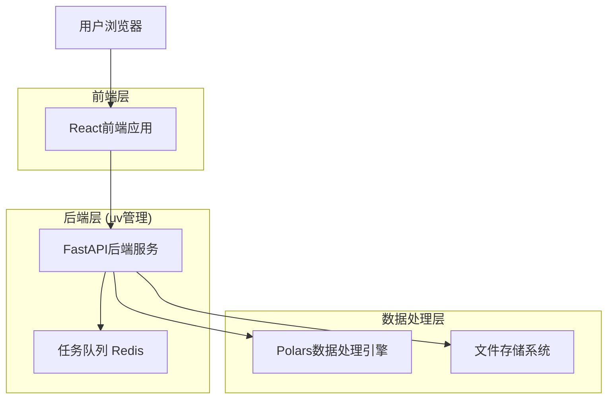
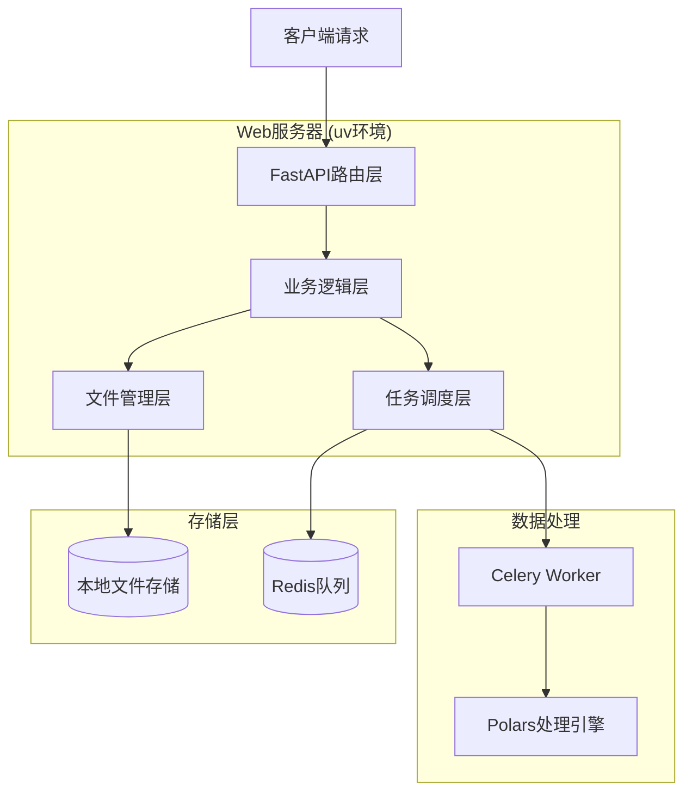
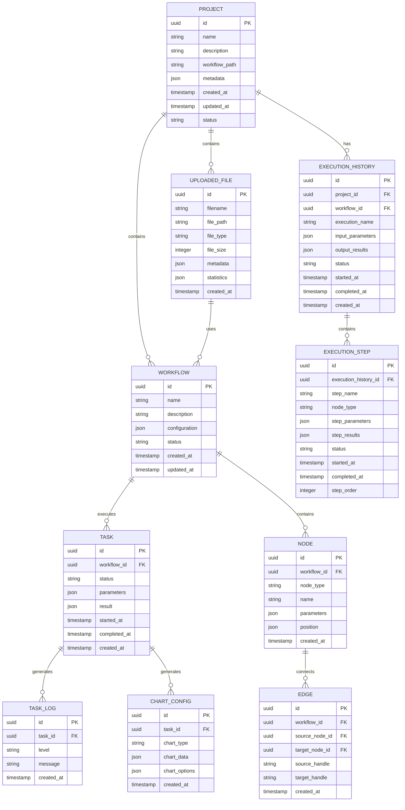

# 数据处理Web应用技术架构文档

## 1. Architecture design



## 2. Technology Description

* Frontend: React\@18 + TypeScript + Antd\@5 + React Flow + ECharts + Vite

* Backend: FastAPI + Python\@3.11 + Polars + Celery + Redis (使用uv进行依赖管理)

* File Storage: 本地文件系统 (支持CSV和Parquet格式)

* Project Management: uv (Python包管理和项目构建工具)

## 3. Route definitions

| Route     | Purpose                  |
| --------- | ------------------------ |
| /         | 主页面，包含文件上传、流程图设计器和节点配置面板 |
| /execute  | 执行页面，显示任务状态、数据可视化和执行结果   |
| /analysis | 数据分析页面，显示数据预览、统计信息和交互式图表 |

## 4. API definitions

### 4.1 Core API

**文件上传相关**

```
POST /api/files/upload
```

Request:

| Param Name | Param Type | isRequired | Description        |
| ---------- | ---------- | ---------- | ------------------ |
| file       | file       | true       | CSV或Parquet格式的数据文件 |

Response:

| Param Name | Param Type | Description |
| ---------- | ---------- | ----------- |
| success    | boolean    | 上传是否成功      |
| file\_id   | string     | 文件唯一标识      |
| file\_info | object     | 文件基本信息      |

```
GET /api/files/{file_id}/preview
```

Response:

| Param Name | Param Type | Description |
| ---------- | ---------- | ----------- |
| columns    | array      | 数据列信息       |
| data       | array      | 预览数据（前100行） |
| statistics | object     | 基本统计信息      |

**流程管理相关**

```
POST /api/workflows
```

Request:

| Param Name  | Param Type | isRequired | Description |
| ----------- | ---------- | ---------- | ----------- |
| name        | string     | true       | 流程名称        |
| description | string     | false      | 流程描述        |
| nodes       | array      | true       | 节点配置数组      |
| edges       | array      | true       | 连接关系数组      |

Response:

| Param Name   | Param Type | Description |
| ------------ | ---------- | ----------- |
| success      | boolean    | 创建是否成功      |
| workflow\_id | string     | 流程ID        |

```
GET /api/workflows
```

Response:

| Param Name | Param Type | Description |
| ---------- | ---------- | ----------- |
| workflows  | array      | 流程列表        |

```
POST /api/workflows/{workflow_id}/execute
```

Request:

| Param Name | Param Type | isRequired | Description |
| ---------- | ---------- | ---------- | ----------- |
| parameters | object     | false      | 执行参数        |

Response:

| Param Name | Param Type | Description |
| ---------- | ---------- | ----------- |
| success    | boolean    | 提交是否成功      |
| task\_id   | string     | 任务ID        |

**任务监控相关**

```
GET /api/tasks/{task_id}/status
```

Response:

| Param Name | Param Type | Description                             |
| ---------- | ---------- | --------------------------------------- |
| status     | string     | 任务状态 (pending/running/completed/failed) |
| progress   | number     | 执行进度 (0-100)                            |
| logs       | array      | 执行日志                                    |
| result     | object     | 执行结果                                    |

**数据可视化相关**

```
POST /api/charts/generate
```

Request:

| Param Name  | Param Type | isRequired | Description |
| ----------- | ---------- | ---------- | ----------- |
| file\_id    | string     | true       | 数据文件ID      |
| chart\_type | string     | true       | 图表类型        |
| x\_field    | string     | true       | X轴字段        |
| y\_field    | string     | false      | Y轴字段        |
| config      | object     | false      | 图表配置参数      |

Response:

| Param Name  | Param Type | Description |
| ----------- | ---------- | ----------- |
| success     | boolean    | 生成是否成功      |
| chart\_data | object     | 图表数据配置      |

**项目管理相关**

```
POST /api/projects
```

Request:

| Param Name  | Param Type | isRequired | Description |
| ----------- | ---------- | ---------- | ----------- |
| name        | string     | true       | 项目名称        |
| description | string     | false      | 项目描述        |
| metadata    | object     | false      | 项目元数据       |

Response:

| Param Name | Param Type | Description |
| ---------- | ---------- | ----------- |
| success    | boolean    | 创建是否成功      |
| project_id | string     | 项目ID        |

```
GET /api/projects
```

Response:

| Param Name | Param Type | Description |
| ---------- | ---------- | ----------- |
| projects   | array      | 项目列表        |
| total      | number     | 项目总数        |

```
GET /api/projects/{project_id}
```

Response:

| Param Name | Param Type | Description |
| ---------- | ---------- | ----------- |
| project    | object     | 项目详细信息      |

```
PUT /api/projects/{project_id}
```

Request:

| Param Name  | Param Type | isRequired | Description |
| ----------- | ---------- | ---------- | ----------- |
| name        | string     | false      | 项目名称        |
| description | string     | false      | 项目描述        |
| metadata    | object     | false      | 项目元数据       |
| status      | string     | false      | 项目状态        |

```
DELETE /api/projects/{project_id}
```

Response:

| Param Name | Param Type | Description |
| ---------- | ---------- | ----------- |
| success    | boolean    | 删除是否成功      |

**执行历史记录相关**

```
GET /api/projects/{project_id}/executions
```

Response:

| Param Name | Param Type | Description |
| ---------- | ---------- | ----------- |
| executions | array      | 执行历史记录列表    |
| total      | number     | 记录总数        |

```
GET /api/executions/{execution_id}
```

Response:

| Param Name | Param Type | Description |
| ---------- | ---------- | ----------- |
| execution  | object     | 执行记录详情      |

```
GET /api/executions/{execution_id}/steps
```

Response:

| Param Name | Param Type | Description |
| ---------- | ---------- | ----------- |
| steps      | array      | 执行步骤列表      |

```
DELETE /api/executions/{execution_id}
```

Response:

| Param Name | Param Type | Description |
| ---------- | ---------- | ----------- |
| success    | boolean    | 删除是否成功      |

```
DELETE /api/executions/{execution_id}/steps/{step_id}
```

Response:

| Param Name | Param Type | Description |
| ---------- | ---------- | ----------- |
| success    | boolean    | 删除是否成功      |

**节点类型相关**

```
GET /api/node-types
```

Response:

| Param Name  | Param Type | Description |
| ----------- | ---------- | ----------- |
| node\_types | array      | 可用节点类型列表    |

Example Response:

```json
{
  "node_types": [
    {
      "id": "data_input",
      "name": "数据输入",
      "category": "input",
      "parameters": [
        {
          "name": "file_id",
          "type": "select",
          "options": "dynamic_file_list"
        }
      ]
    },
    {
      "id": "data_visualization",
      "name": "数据可视化",
      "category": "output",
      "parameters": [
        {
          "name": "chart_type",
          "type": "select",
          "options": ["bar", "line", "scatter", "heatmap"]
        }
      ]
    }
  ]
}
```

## 5. Server architecture diagram



## 6. Data model

### 6.1 Data model definition



### 6.2 数据存储设计

本项目采用基于文件的轻量级数据存储方案，无需传统数据库，所有数据以JSON文件形式存储在本地文件系统中。

**文件存储结构**

```
data/
├── projects/                   # 项目管理
│   ├── {project_id}.json      # 项目信息文件
│   └── index.json             # 项目索引文件
├── uploads/                    # 用户上传的数据文件
│   ├── {file_id}.csv
│   ├── {file_id}.parquet
│   └── metadata/
│       └── {file_id}.json     # 文件元数据和统计信息
├── workflows/                  # 工作流配置文件
│   └── {workflow_id}.json
├── executions/                 # 执行历史记录
│   ├── {execution_id}.json    # 执行记录主文件
│   ├── steps/                 # 执行步骤详情
│   │   └── {execution_id}/
│   │       ├── step_1.json
│   │       ├── step_2.json
│   │       └── ...
│   └── results/               # 执行结果文件
│       └── {execution_id}/
│           ├── input_data.csv
│           ├── output_data.csv
│           └── charts/
├── tasks/                      # 任务执行记录
│   ├── {task_id}.json
│   └── logs/
│       └── {task_id}.log
├── charts/                     # 图表配置和数据
│   └── {chart_id}.json
└── temp/                       # 临时处理文件
    └── {task_id}/
```

**数据文件格式定义**

**项目信息文件 (projects/{project_id}.json)**

```json
{
  "id": "uuid",
  "name": "销售数据分析项目",
  "description": "分析2024年销售数据趋势和客户行为",
  "workflow_path": "workflows/workflow_uuid.json",
  "metadata": {
    "tags": ["销售", "数据分析", "可视化"],
    "category": "business_analysis",
    "version": "1.0.0",
    "author": "数据分析师"
  },
  "created_at": "2024-01-15T10:30:00Z",
  "updated_at": "2024-01-15T15:45:00Z",
  "status": "active",
  "execution_count": 5,
  "last_execution_id": "execution_uuid",
  "associated_files": [
    "file_uuid_1",
    "file_uuid_2"
  ]
}
```

**项目索引文件 (projects/index.json)**

```json
{
  "projects": [
    {
      "id": "project_uuid_1",
      "name": "销售数据分析项目",
      "status": "active",
      "created_at": "2024-01-15T10:30:00Z",
      "updated_at": "2024-01-15T15:45:00Z"
    },
    {
      "id": "project_uuid_2",
      "name": "客户行为分析",
      "status": "archived",
      "created_at": "2024-01-10T09:00:00Z",
      "updated_at": "2024-01-12T16:30:00Z"
    }
  ],
  "total_count": 2,
  "last_updated": "2024-01-15T15:45:00Z"
}
```

**执行历史记录 (executions/{execution_id}.json)**

```json
{
  "id": "uuid",
  "project_id": "project_uuid",
  "workflow_id": "workflow_uuid",
  "execution_name": "数据清洗和分析 - 第3次执行",
  "input_parameters": {
    "input_file_id": "file_uuid",
    "filter_conditions": {
      "date_range": ["2024-01-01", "2024-01-31"],
      "region": "华东地区"
    },
    "processing_options": {
      "remove_duplicates": true,
      "fill_missing_values": "mean"
    }
  },
  "output_results": {
    "processed_records": 15000,
    "removed_duplicates": 150,
    "filled_missing_values": 45,
    "output_file_path": "executions/results/execution_uuid/output_data.csv",
    "charts_generated": [
      "chart_uuid_1",
      "chart_uuid_2"
    ],
    "summary_statistics": {
      "total_sales": 2500000,
      "average_order_value": 166.67,
      "top_product": "产品A"
    }
  },
  "status": "completed",
  "started_at": "2024-01-15T14:30:00Z",
  "completed_at": "2024-01-15T14:35:30Z",
  "created_at": "2024-01-15T14:30:00Z",
  "execution_time_seconds": 330,
  "step_count": 5,
  "error_message": null
}
```

**执行步骤详情 (executions/steps/{execution_id}/step_{order}.json)**

```json
{
  "id": "uuid",
  "execution_history_id": "execution_uuid",
  "step_name": "数据过滤",
  "node_type": "data_filter",
  "step_parameters": {
    "filter_conditions": {
      "column": "sales_amount",
      "operator": ">",
      "value": 100
    }
  },
  "step_results": {
    "input_records": 20000,
    "output_records": 15000,
    "filtered_records": 5000,
    "processing_time_ms": 1200,
    "memory_usage_mb": 45
  },
  "status": "completed",
  "started_at": "2024-01-15T14:31:00Z",
  "completed_at": "2024-01-15T14:31:15Z",
  "step_order": 2,
  "error_message": null,
  "warnings": []
}
```

**上传文件元数据 (uploads/metadata/{file\_id}.json)**

```json
{
  "id": "uuid",
  "filename": "original_filename.csv",
  "file_path": "uploads/uuid.csv",
  "file_type": "csv|parquet",
  "file_size": 1024000,
  "metadata": {
    "columns": [
      {"name": "column1", "type": "string", "nullable": true},
      {"name": "column2", "type": "int64", "nullable": false}
    ],
    "row_count": 10000
  },
  "statistics": {
    "numeric_columns": 5,
    "string_columns": 3,
    "missing_values": 150
  },
  "created_at": "2024-01-15T10:30:00Z"
}
```

**工作流配置 (workflows/{workflow\_id}.json)**

```json
{
  "id": "uuid",
  "name": "数据清洗流程",
  "description": "清洗和转换销售数据",
  "configuration": {
    "nodes": [
      {
        "id": "node1",
        "type": "data_input",
        "parameters": {"file_id": "upload_file_uuid"},
        "position": {"x": 100, "y": 100}
      }
    ],
    "edges": [
      {
        "id": "edge1",
        "source": "node1",
        "target": "node2"
      }
    ]
  },
  "status": "draft|active|archived",
  "created_at": "2024-01-15T10:30:00Z",
  "updated_at": "2024-01-15T11:00:00Z"
}
```

**任务执行记录 (tasks/{task\_id}.json)**

```json
{
  "id": "uuid",
  "workflow_id": "workflow_uuid",
  "status": "pending|running|completed|failed|cancelled",
  "parameters": {},
  "result": {
    "output_file_path": "temp/task_id/result.csv",
    "charts": ["chart_id1", "chart_id2"],
    "statistics": {}
  },
  "started_at": "2024-01-15T10:30:00Z",
  "completed_at": "2024-01-15T10:35:00Z",
  "created_at": "2024-01-15T10:30:00Z"
}
```

**图表配置 (charts/{chart\_id}.json)**

```json
{
  "id": "uuid",
  "task_id": "task_uuid",
  "chart_type": "bar|line|scatter|heatmap",
  "chart_data": {
    "x_field": "date",
    "y_field": "sales",
    "data": []
  },
  "chart_options": {
    "title": "销售趋势图",
    "theme": "default",
    "colors": ["#1890ff", "#52c41a"]
  },
  "created_at": "2024-01-15T10:35:00Z"
}
```

**项目依赖管理 (pyproject.toml)**

使用uv工具管理Python项目依赖：

```toml
[project]
name = "dlflow"
version = "0.1.0"
description = "数据处理Web应用"
requires-python = ">=3.11"
dependencies = [
    "fastapi>=0.104.0",
    "polars>=0.20.0",
    "celery>=5.3.0",
    "redis>=5.0.0",
    "uvicorn>=0.24.0",
    "python-multipart>=0.0.6"
]

[build-system]
requires = ["hatchling"]
build-backend = "hatchling.build"

[tool.uv]
dev-dependencies = [
    "pytest>=7.4.0",
    "black>=23.0.0",
    "ruff>=0.1.0"
]
```

