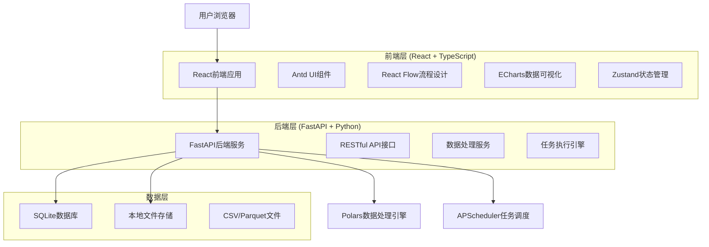

# DLFlow - 智能数据处理Web平台 🚀

<div align="center">
  
  
  
  
  
  
  
  
</div>

## 📖 项目概述

DLFlow 是一个现代化的智能数据处理Web平台，专为数据分析师和工程师打造。通过直观的可视化界面，用户可以轻松构建复杂的数据处理流水线，无需编写繁琐的代码。平台支持CSV和Parquet格式文件处理，具备智能时间数据识别、多变量分析和实时可视化等强大功能。

### 🎯 核心价值

- **🎨 可视化设计**：拖拽式节点构建数据处理流程，降低技术门槛
- **🧠 智能识别**：自动识别时间数据格式（DateTime/tagTime），支持多变量综合分析
- **📊 实时监控**：任务状态监控、执行日志查看和动态数据可视化
- **✨ 科技感UI**：采用科技蓝主题配色和霓虹效果的未来感界面设计
- **⚡ 高性能架构**：基于SQLite + APScheduler的轻量级架构，使用uv进行依赖管理

## ✨ 功能列表

### 🗂️ 项目管理
- 项目创建、编辑、删除和归档
- 项目状态管理和批量操作
- 项目列表展示和搜索筛选

### 📁 文件处理
- 支持CSV和Parquet格式文件上传
- 拖拽上传和进度显示
- 文件格式验证和错误提示
- 数据预览和统计信息展示

### 🔄 工作流设计
- 可视化流程图设计器
- 丰富的节点库（数据输入、清洗、转换、聚合、输出）
- 节点参数配置和连接管理
- 撤销重做操作支持

### ⏱️ 时间数据处理
- 自动识别DateTime格式（标准日期时间）
- 支持tagTime格式（YYYYMMDDHH小时数据）
- 时间序列数据排序和筛选
- 时间范围选择功能

### 📊 数据可视化
- 多种图表类型（柱状图、折线图、散点图、热力图）
- 处理前后数据对比展示
- 交互式图表配置
- 字段映射和实时预览

### 🚀 任务执行
- 实时任务状态监控
- 执行日志查看和筛选
- 进度条和执行时间统计
- 结果预览和数据下载

### 📝 历史记录
- 执行历史列表和详情查看
- 步骤级别的结果展示
- 历史记录管理和批量删除
- 时间范围筛选功能

### 🔍 多变量分析
- 自动识别所有变量类型
- 变量间相关性分析
- 多变量联合统计
- 完整性保证机制

## 🛠️ 技术栈

### 🎨 前端技术

| 技术 | 版本 | 用途 |
|------|------|------|
| **React** | 18.3.1 | 核心UI框架，提供组件化开发能力 |
| **TypeScript** | 5.8.3 | 类型安全的JavaScript超集 |
| **Antd** | 5.27.0 | 企业级UI组件库，提供丰富的交互组件 |
| **React Flow** | 11.11.4 | 可视化流程图设计器核心库 |
| **ECharts** | 6.0.0 | 数据可视化图表库 |
| **React Router** | 7.3.0 | 单页应用路由管理 |
| **Zustand** | 5.0.3 | 轻量级状态管理库 |
| **Vite** | 6.3.5 | 现代化前端构建工具 |
| **Tailwind CSS** | 3.4.17 | 原子化CSS框架，实现科技感UI设计 |
| **Lucide React** | 0.511.0 | 现代化图标库 |

### ⚙️ 后端技术

| 技术 | 版本 | 用途 |
|------|------|------|
| **FastAPI** | 0.104+ | 高性能异步Web框架 |
| **Python** | 3.11+ | 后端开发语言 |
| **SQLite** | - | 轻量级嵌入式数据库 |
| **SQLAlchemy** | 2.0+ | Python ORM框架 |
| **Polars** | 0.20+ | 高性能数据处理引擎 |
| **APScheduler** | 3.10+ | 任务调度框架，替代Celery |
| **Pydantic** | 2.0+ | 数据验证和序列化 |
| **Uvicorn** | 0.24+ | ASGI服务器 |
| **aiofiles** | 23.0+ | 异步文件操作 |
| **uv** | - | Python包管理和项目构建工具 |

### 🏗️ 架构设计



**架构特点：**
- 🔄 **前后端分离**：React SPA + FastAPI RESTful API
- 🗄️ **轻量级数据库**：SQLite嵌入式数据库，无需额外部署
- ⚡ **高性能处理**：Polars数据处理引擎，比Pandas快10-100倍
- 🕐 **简化任务调度**：APScheduler替代Redis+Celery，减少外部依赖
- 📁 **本地文件存储**：支持CSV和Parquet格式，无需云存储
- 🔧 **现代化工具链**：uv包管理 + Vite构建 + TypeScript类型安全

## 🛠️ 环境搭建

### 📋 系统要求

- **Node.js**: 18.0+ (推荐使用 24.5.0)
- **Python**: 3.11+
- **uv**: Python包管理工具
- **操作系统**: Windows 10+, macOS 10.15+, Linux

> 💡 **简化部署**：本项目已移除Redis依赖，使用SQLite + APScheduler实现轻量级架构，大大简化了部署复杂度！

### 🔧 环境准备

#### 1. 安装Node.js
```bash
# 下载并安装Node.js 24.5.0
# 访问 https://nodejs.org/ 下载对应版本

# 验证安装
node --version
npm --version
```

#### 2. 安装Python和uv
```bash
# 安装Python 3.11+
# 访问 https://www.python.org/downloads/ 下载对应版本

# 安装uv包管理工具 (推荐方式)
curl -LsSf https://astral.sh/uv/install.sh | sh

# Windows用户可以使用PowerShell
powershell -c "irm https://astral.sh/uv/install.ps1 | iex"

# 或者使用pip安装
pip install uv

# 验证安装
python --version
uv --version
```

### 📦 项目安装

#### 1. 克隆项目
```bash
git clone <repository-url>
cd dlflow
```

#### 2. 安装前端依赖
```bash
# 进入前端目录
cd frontend

# 使用npm安装依赖
npm install

# 或者使用pnpm（推荐，更快的包管理器）
npm install -g pnpm
pnpm install

# 返回项目根目录
cd ..
```

#### 3. 安装后端依赖
```bash
# 进入后端目录
cd backend

# 使用uv安装依赖（自动创建虚拟环境）
uv sync

# 验证安装
uv run python --version
```

#### 4. 数据库初始化
```bash
# 后端目录下，初始化SQLite数据库
uv run python -c "from app.database import init_db; init_db()"

# 数据库文件将创建在 data/dlflow.db
```

## 🚀 运行指南

### 🏃‍♂️ 启动项目

#### 方式一：同时启动前后端（推荐）
```bash
# 在项目根目录执行
npm run dev
```

#### 方式二：分别启动
```bash
# 启动前端开发服务器
cd frontend
npm run dev
# 🌐 前端访问地址: http://localhost:5173

# 启动后端服务器（新终端）
cd backend
uv run python main.py
# 🔗 API服务地址: http://localhost:8000
# 📚 API文档地址: http://localhost:8000/docs
```

### 🔍 服务验证

启动成功后，你可以通过以下方式验证服务状态：

```bash
# 检查前端服务
curl http://localhost:5173

# 检查后端API健康状态
curl http://localhost:8000/health

# 查看API文档
# 浏览器访问: http://localhost:8000/docs
```

### ⚡ 使用 Just 命令（推荐）

为了简化项目管理和开发流程，我们提供了 `just` 命令工具，让您可以通过简单的命令快速执行常用操作。

#### 📦 安装 Just

```bash
# Windows (使用 Scoop)
scoop install just

# Windows (使用 Chocolatey)
choco install just

# macOS (使用 Homebrew)
brew install just

# Linux (使用 Cargo)
cargo install just

# 或者从 GitHub 下载预编译二进制文件
# https://github.com/casey/just/releases
```

#### 🚀 常用 Just 命令

```bash
# 📋 查看所有可用命令
just

# 📦 安装所有项目依赖
just install

# 🚀 同时启动前端和后端服务（推荐）
just dev

# 🎨 仅启动前端开发服务器
just frontend

# 🐍 仅启动后端API服务器
just backend

# 🧹 清理项目缓存和临时文件
just clean

# 🔄 重置项目（清理+重新安装依赖）
just reset

# 📊 显示项目状态
just status

# 📖 显示详细帮助信息
just help
```

#### 🎯 快速开始（使用 Just）

```bash
# 1. 克隆项目
git clone <repository-url>
cd dlflow

# 2. 安装 just（如果尚未安装）
# 参考上面的安装方法

# 3. 安装所有依赖
just install

# 4. 启动开发环境
just dev

# 5. 访问应用
# 前端: http://localhost:5173
# 后端: http://localhost:8000
# API文档: http://localhost:8000/docs
```

#### 💡 Just 命令优势

- **🎯 简化操作**：一个命令完成复杂的操作流程
- **📝 清晰文档**：每个命令都有详细的中文注释
- **🔄 跨平台**：支持 Windows、macOS 和 Linux
- **⚡ 高效开发**：减少重复的命令输入
- **🛠️ 统一管理**：集中管理项目的所有操作命令

> 💡 **提示**：使用 `just` 命令可以大大提高开发效率，特别是在需要频繁启动/停止服务的开发过程中。所有命令都包含了详细的中文说明和状态提示。

## 📚 API文档

### 🔗 API访问方式

- **API基础地址**: `http://localhost:8000`
- **交互式文档**: `http://localhost:8000/docs` (Swagger UI)
- **API规范文档**: `http://localhost:8000/redoc` (ReDoc)

### 📋 核心API接口

#### 🗂️ 项目管理
```http
# 获取项目列表
GET /api/projects

# 创建新项目
POST /api/projects
Content-Type: application/json
{
  "name": "项目名称",
  "description": "项目描述"
}

# 获取项目详情
GET /api/projects/{project_id}
```

#### 📁 文件管理
```http
# 上传数据文件
POST /api/files/upload
Content-Type: multipart/form-data

# 获取文件预览
GET /api/files/{file_id}/preview

# 下载处理结果
GET /api/files/{file_id}/download
```

#### 🔄 工作流管理
```http
# 创建工作流
POST /api/workflows
Content-Type: application/json
{
  "name": "工作流名称",
  "nodes": [...],
  "edges": [...]
}

# 执行工作流
POST /api/workflows/{workflow_id}/execute

# 获取执行状态
GET /api/tasks/{task_id}/status
```

#### 📊 数据可视化
```http
# 生成图表
POST /api/charts/generate
Content-Type: application/json
{
  "file_id": "文件ID",
  "chart_type": "bar|line|scatter|heatmap",
  "x_field": "X轴字段",
  "y_field": "Y轴字段"
}
```

### 🔧 API认证

当前版本采用**无认证设计**，所有API接口均可直接访问。未来版本将支持JWT令牌认证。

### ⚙️ 配置说明

#### 前端配置 (vite.config.ts)
```typescript
export default defineConfig({
  server: {
    port: 5173,
    proxy: {
      '/api': {
        target: 'http://localhost:8000',
        changeOrigin: true
      }
    }
  }
})
```

#### 后端配置 (backend/app/core/config.py)
```python
class Settings(BaseSettings):
    # 服务器配置
    HOST: str = "0.0.0.0"
    PORT: int = 8000
    
    # 数据库配置
    DATABASE_URL: str = "sqlite:///./data/dlflow.db"
    
    # 文件存储配置
    UPLOAD_DIR: str = "./data/uploads"
    MAX_FILE_SIZE: int = 100 * 1024 * 1024  # 100MB
    
    # 任务调度配置
    SCHEDULER_TIMEZONE: str = "Asia/Shanghai"
```

## 🤝 贡献指南

### 🎯 贡献方式

我们欢迎各种形式的贡献，包括但不限于：

- 🐛 **Bug报告**：发现问题请提交Issue
- ✨ **功能建议**：提出新功能想法和改进建议
- 📝 **文档改进**：完善文档、添加示例
- 💻 **代码贡献**：修复Bug、实现新功能
- 🧪 **测试用例**：添加单元测试和集成测试

### 🔧 开发流程

#### 1. 环境准备
```bash
# Fork项目到你的GitHub账户
# 克隆你的Fork
git clone https://github.com/your-username/dlflow.git
cd dlflow

# 添加上游仓库
git remote add upstream https://github.com/original-repo/dlflow.git

# 安装开发依赖
npm install
cd backend && uv sync
```

#### 2. 创建功能分支
```bash
# 从main分支创建新分支
git checkout -b feature/your-feature-name

# 或者修复Bug
git checkout -b fix/bug-description
```

#### 3. 开发和测试
```bash
# 前端代码检查
npm run lint
npm run check

# 后端代码检查
cd backend
uv run ruff check .
uv run black --check .
uv run mypy .

# 运行测试
uv run pytest
```

#### 4. 提交代码
```bash
# 提交代码（请使用有意义的提交信息）
git add .
git commit -m "feat: 添加新功能描述"

# 推送到你的Fork
git push origin feature/your-feature-name
```

#### 5. 创建Pull Request

1. 访问GitHub上的项目页面
2. 点击"New Pull Request"
3. 选择你的分支并填写PR描述
4. 等待代码审查和合并

### 📝 代码规范

#### 前端代码规范
- 使用TypeScript进行类型安全开发
- 遵循ESLint配置的代码风格
- 组件命名使用PascalCase
- 文件命名使用kebab-case
- 添加适当的注释和文档

#### 后端代码规范
- 遵循PEP 8 Python代码规范
- 使用Black进行代码格式化
- 使用Ruff进行代码检查
- 使用MyPy进行类型检查
- 编写完整的docstring文档

### 🧪 测试要求

- 新功能必须包含相应的测试用例
- 确保所有测试通过
- 测试覆盖率应保持在80%以上
- 提供集成测试验证端到端功能

## 📄 许可证信息

本项目采用 **MIT 许可证** 开源。

```
MIT License

Copyright (c) 2025 DLFlow Contributors

Permission is hereby granted, free of charge, to any person obtaining a copy
of this software and associated documentation files (the "Software"), to deal
in the Software without restriction, including without limitation the rights
to use, copy, modify, merge, publish, distribute, sublicense, and/or sell
copies of the Software, and to permit persons to whom the Software is
furnished to do so, subject to the following conditions:

The above copyright notice and this permission notice shall be included in all
copies or substantial portions of the Software.

THE SOFTWARE IS PROVIDED "AS IS", WITHOUT WARRANTY OF ANY KIND, EXPRESS OR
IMPLIED, INCLUDING BUT NOT LIMITED TO THE WARRANTIES OF MERCHANTABILITY,
FITNESS FOR A PARTICULAR PURPOSE AND NONINFRINGEMENT. IN NO EVENT SHALL THE
AUTHORS OR COPYRIGHT HOLDERS BE LIABLE FOR ANY CLAIM, DAMAGES OR OTHER
LIABILITY, WHETHER IN AN ACTION OF CONTRACT, TORT OR OTHERWISE, ARISING FROM,
OUT OF OR IN CONNECTION WITH THE SOFTWARE OR THE USE OR OTHER DEALINGS IN THE
SOFTWARE.
```

### 🙏 致谢

感谢所有为DLFlow项目做出贡献的开发者和用户！

- 🌟 **Star** 本项目以支持我们的工作
- 🐛 **报告问题** 帮助我们改进产品
- 💡 **提出建议** 让产品变得更好
- 🤝 **参与开发** 一起构建更强大的数据处理平台

---

<div align="center">
  <p>🚀 <strong>让数据处理变得简单而强大！</strong> 🚀</p>
  <p>Made with ❤️ by DLFlow Team</p>
</div>